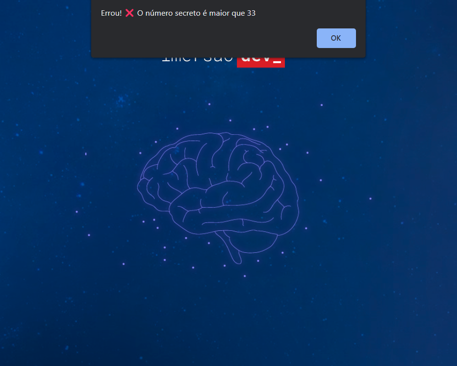

<h1 align="center">Mentalista</h1>

Imersão Dev é um evento exclusivo e gratuito, promovido pela Alura para ensino de tecnologias WEB.  

  <a href="#-tecnologias">Tecnologias</a>     |    
  <a href="#-projeto">Projeto</a>     |    
  <a href="#-layout">Layout</a>     |    
  <a href="#-licença">Licença</a>

  

 

  

## 🚀 Tecnologias

Esse projeto foi desenvolvido com as seguintes tecnologias:

- HTML e CSS
- JavaScript
- Git e Github
- CodePen

## 💻 Projeto

O Mentalista é um jogo de adivinhação, no qual o programa escolhe um número aleatório onde o usuário deve acertar. Através de um prompt o usuário digita um número e a lógica do jogo usando estrutura de verificação como if e else retorna mensagens em um alert com dicas para ajudar na adivinhação.

- [ Visite o projeto online ](https://lipeharakawa.github.io/mentalista)

## 🔖 Layout

Você pode visualizar o layout base do projeto através de [ DESSE LINK ](https://codepen.io/imersao-dev/pen/JjZpvRQ). É necessário ter conta no [ CodePen ](https://codepen.io/accounts/signup/user/free) para acessá-lo.

## ✅ Licença

Esse projeto está sob a licença MIT.

---

Feito com ❤️ por Felipe Seidi Harakawa, durante o evento Imersão Dev da Alura. [ Visite o site! ](https://www.alura.com.br)
